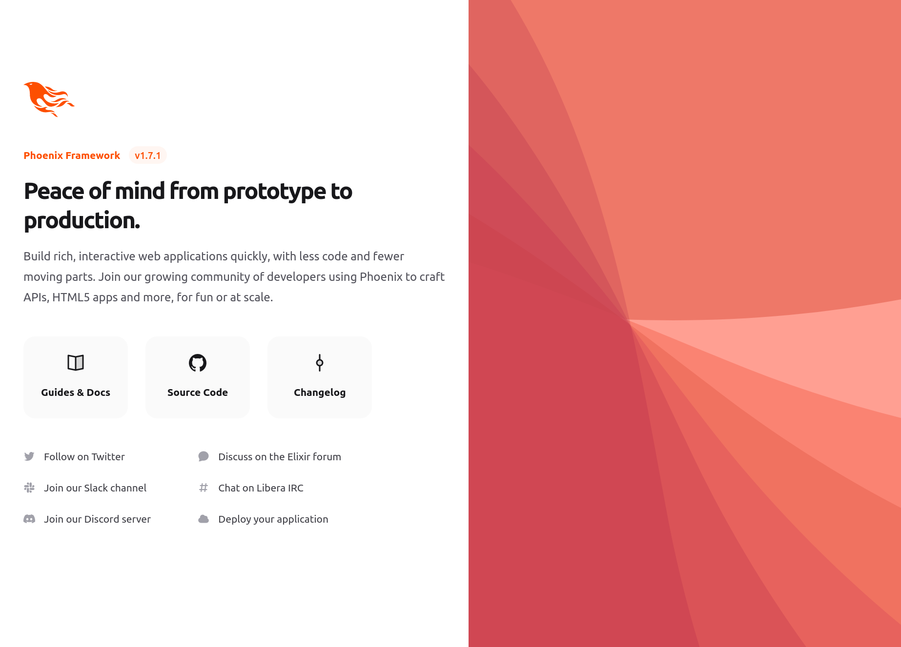
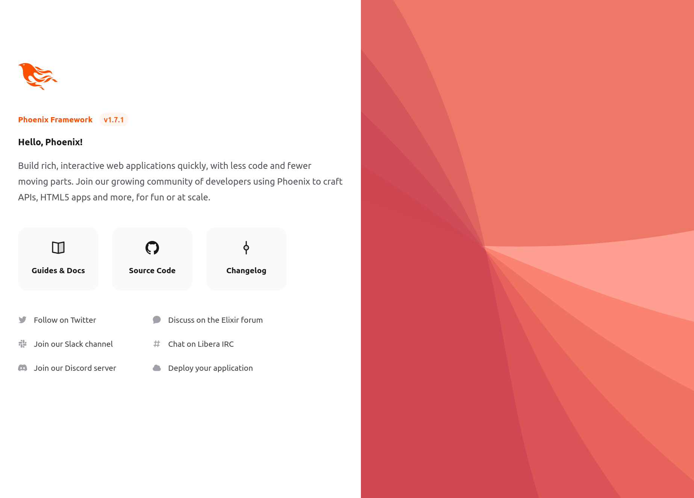
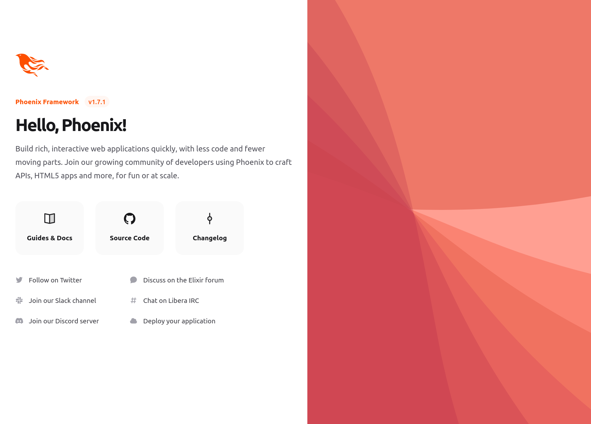

Getting Started with Phoenix 1.7 with Svelte
====
### Cybernetically enhanced Phoenix Web applications

> This repository contains the accompanying code to the article: [Phoenix 1.7 with Svelte](https://medium.com/@alistairisrael/phoenix-1-7-with-svelte-12257d853ed1)

I've written about getting up and running with Elixir + Phoenix, Typescript, and React several times, updating them periodically with each major Phoenix release. This time, though, let us explore another promising front-end Web framework: [Svelte](https://svelte.dev).


## Why Svelte?

[Svelte](https://svelte.dev) is a relatively recent  front-end Web application framework, at least compared to stalwarts such as React. Svelte differentiates itself by performing much of its magic at _compile-time_, rather than at run-time in the user's browser.

More compellingly, it promises a more pleasant developer experience by reducing the amount of code (and therefore, the surface area for potential bugs) required to implement the same features than its competitors.

There must be something to it, as it was voted the [most loved Web framework in 2021](https://insights.stackoverflow.com/survey/2021#section-most-loved-dreaded-and-wanted-web-frameworks), and in 2022, [it came only second to Elixir's Phoenix](https://survey.stackoverflow.co/2022/#section-most-loved-dreaded-and-wanted-web-frameworks-and-technologies)!

So it's just natural that we try to use both of them together. Let's get started!


### Prerequisites

To follow along, you will need (with versions as of this writing):

- [Erlang/OTP 25](https://www.erlang.org)
- [Elixir 1.14.2](https://elixir-lang.org)
- [Phoenix 1.7.1](https://www.phoenixframework.org)
- [node v19.7.0](https://nodejs.org/en/)
- git
- [Docker](https://www.docker.com) with Docker Compose


---

## Hello, Phoenix

> For those already familiar with setting up a Phoenix project, you may wish to skip to the next section.

Let's go ahead and generate our starter Phoenix project:

```bash
mix phx.new hello
```


### PostgreSQL, MySQL, or None

Phoenix by default uses Postgres for its database.

If you want to use MySQL rather than Postgres, then you'll need to generate your Phoenix app using

```bash
mix phx.new hello_react --umbrella --database mysql
```

If you won't be needing a database or only wish to follow along without one, then create your Phoenix app using

```bash
mix phx.new hello_react --umbrella --no-ecto
```

The rest of this guide, however, assumes the default which is Postgres.


### git

At this point, we should start using Git to track our changes. If you don't need to use Git, feel free to skip to the next section.

```bash
$ cd hello

hello$ git init
hello$ git add -A
hello$ git commit -m "mix phx.new hello"
```

### Docker Compose

We'll be needing a PostgreSQL server to run our Phoenix app. For local development and testing purposes I've found that using Docker, or specifically, [Docker Compose](https://docs.docker.com/compose/) makes dealing with service dependencies a breeze.

Create the following docker-compose.yml file in the project root:

```yaml
version: "3"
services:
  postgres:
    image: postgres:14.6-alpine
    ports:
      - 5432:5432
    environment:
      POSTGRES_USER: postgres
      POSTGRES_PASSWORD: postgres
      POSTGRES_DB: hello_dev
```

Note that we configure PostgreSQL (using the `POSTGRES_*` environment variables) to work with the generated Phoenix app defaults.

Then, to run Postgres in the background you only need to go:

```bash
hello$ docker compose up -d
[+] Running 1/1
 ⠿ Container hello-postgres-1  Started   
```

For other Docker Compose commands please just visit [https://docs.docker.com/compose/reference](https://docs.docker.com/compose/reference/).

If you can't or don't want to use Docker and Docker Compose, you'll have to find a way to run PostgreSQL on your local workstation. Make sure to configure it with the same defaults generated by mix phx.new, or, modify the respective configuration files with the appropriate configuration.


### Peace of mind from prototype to production

At this point we should be able to run our Phoenix application. From the project root (you may wish to run this in a new terminal window or tab), just go:

```bash
mix phx.server
```

Now if we visit [http://localhost:4000](http://localhost:4000) we should be able to see the default Phoenix landing page:




---

## Cybernetically Enhanced Phoenix

Now we're ready to add [Svelte](https://svelte.dev) into the mix. The rest of this guide borrows from the following sources, but I try to be  less opinionated (than the Svonix framework) and have slightly updated it for Phoenix 1.7:

- [E2E Reactivity using Svelte with Phoenix LiveView](https://dev.to/debussyman/e2e-reactivity-using-svelte-with-phoenix-liveview-38mf)
- [Svonix - Svelte & Phoenix > 1.6 - easily create and use Svelte components in Phoenix](https://elixirforum.com/t/svonix-svelte-phoenix-1-6-easily-create-and-use-svelte-components-in-phoenix/45222)


### Install our Node modules

First, we'll need to cd into the assets directory and install svelte and other required Javascript libraries:

```
npm install esbuild svelte esbuild-svelte --save-dev
npm install ../deps/phoenix ../deps/phoenix_html ../deps/phoenix_live_view --save
```

We need to point to the Phoenix package libraries so esbuild will be able to compile everything together properly later on.


### Write a custom build script

Phoenix 1.6 switched to [esbuild](https://esbuild.github.io/), but esbuild doesn't support Svelte out of the box. To make esbuild work with Svelte, we'll have to [write a custom build script](https://hexdocs.pm/phoenix/asset_management.html#esbuild-plugins) and use the [esbuild-svelte](https://www.npmjs.com/package/esbuild-svelte) plugin.

Create the following file `assets/build.js`:

```js
const esbuild = require('esbuild')
const sveltePlugin = require('esbuild-svelte')

const args = process.argv.slice(2)
const watch = args.includes('--watch')
const deploy = args.includes('--deploy')

const loader = {
    // Add loaders for images/fonts/etc, e.g. { '.svg': 'file' }
}

const plugins = [
    // Add and configure plugins here
    sveltePlugin(),
    // ... other plugins such as postCss, etc.
]

let opts = {
    entryPoints: ['js/app.js'],
    mainFields: ["svelte", "browser", "module", "main"],
    bundle: true,
    minify: false,
    target: 'es2017',
    outdir: '../priv/static/assets',
    logLevel: 'info',
    loader,
    plugins
}

if (watch) {
    opts = {
        ...opts,
        sourcemap: true,
    }
}

if (deploy) {
    opts = {
        ...opts,
        minify: true
    }
}

esbuild.context(opts).then(context => {
    if (watch) {
        context.watch()
    }
})
```

This is pretty much the same custom build script from the [Phoenix documentation](https://hexdocs.pm/phoenix/asset_management.html#esbuild-plugins) and from [Ryan Cooke's article](https://dev.to/debussyman/e2e-reactivity-using-svelte-with-phoenix-liveview-38mf).

We've just had to change a few lines since [esbuild 0.17.0](https://github.com/evanw/esbuild/blob/main/CHANGELOG.md#0170) removed the `--watch` option and replaced it with the new `context()` method. The `context.watch()` line towards the end there is what lets Svelte work seamless with Phoenix Live Reload.

Now we need to modify `config/dev.exs` so that the script runs whenever you change files, replacing the existing `esbuild:` configuration under `watchers:`

```js
  watchers: [ 
    node: ["build.js", "--watch", cd: Path.expand("../assets", __DIR__)],
```

We're now ready to go ahead and write our first Svelte component!


---

## Hello, Svelte!

Let's create a folder `assets/js/svelte` and go ahead and create a file `Greeter.svelte` under it:

```html
<p class="mt-4 text-4xl font-semibold leading-10 tracking-tighter text-zinc-900">
    Hello, Phoenix!
</p>
```

We'll need a place to 'mount' our component in our Phoenix generated HTML. Let's go ahead and edit `lib/hello_web/controllers/page_html/home.html.heex` and replace the entire:

```html
<p class="mt-4 text-[2rem] font-semibold leading-10 tracking-tighter text-zinc-900">
  Peace of mind from prototype to production.
</p>
```

with just:

```html
<div id="Greeter" />
```

Now we need a way for our `app.js` entrypoint to replace that `div` with our Svelte component.

Since we're just getting started, for simplicity let's just use a `window.onload()` function to mount our component by hand.

In `assets/js/app.js`, add the following lines toward the end:

```js
import Greeter from './svelte/Greeter.svelte'

window.onload = async function () {
    const targetId = 'Greeter';
    const target = document.getElementById(targetId);

    if (!target) {
        return;
    }

    let props = {};

    const component = new Greeter({ target, props });
}
```

At this point, if we restart our Phoenix server and reload [http://localhost:4000](http://localhost:4000), we should successfully see our Svelte component render properly:




### Phoenix, Tailwind and Svelte

You might notice, however, that the "Hello, Phoenix!" text is styled differently from before.

This is because [Phoenix 1.7 now has Tailwind built-in](https://medium.com/r/?url=https%3A%2F%2Fphoenixframework.org%2Fblog%2Fphoenix-1.7-final-released), and Tailwind will only include classes that it can 'see' in the CSS. 

When we moved our CSS classes from `home.html.heex` to `Greeter.svelte`, the default Tailwind configuration that Phoenix uses couldn't detect the classes in Greeter.svelte.

We can either tell [Tailwind to safelist certain classes](https://medium.com/r/?url=https%3A%2F%2Ftailwindcss.com%2Fdocs%2Fcontent-configuration%23safelisting-classes), but that's not recommended (and personally, I reserve that for classes that are dynamically used at run-time). Alternatively, we can use `<style>` tags and [component-scoped styles in Svelte](https://medium.com/r/?url=https%3A%2F%2Fsvelte.dev%2Ftutorial%2Fstyling).

But if we want to continue to use the Tailwind CSS classes in our Svelte components, we just have to edit `assets/tailwind.config.js` to let it know about our `.svelte` files:

```js
module.exports = {
  content: [
    "./js/**/*.js",
    "./js/svelte/**/*.svelte", # Let Tailwind find classes in .svelte files
    "../lib/*_web.ex",
    "../lib/*_web/**/*.*ex"
  ],
```

After that, our Tailwind classes in our Svelte components should now work as before:



---

## Exploring Svelte

As it is, our `Greeter` Svelte component isn't very impressive - it's just a static block of HTML text!

While this article isn't intended to be an in-depth Svelte tutorial, let's at least exercise some of what made us want to use Svelte in the first place.


## Adding some data

Let's add a `<script>` section to our Svelte component, and start using a variable for who to Greet:

```svelte
<script>
    let name = "Phoenix"
</script>

<p class="mt-4 text-4xl font-semibold leading-10 tracking-tighter text-zinc-900">
    Hello, {name}!
</p>
```

This should effectively render the exact same output as before.


### Component Properties

Now, a component that is entirely self-contained often isn't very useful. We want a way to be able to pass in data from our Phoenix application to our Svelte component.

For simplicity, we'll just rely on `data-` attributes in our `<div>` 'mount point':

```html
    <div id="Greeter" data-name="Phoenix" />
```

Then, as described in [the Svelte tutorial](https://medium.com/r/?url=https%3A%2F%2Fsvelte.dev%2Ftutorial%2Fdeclaring-props), we need to declare the name property in our component. So we change the `<script>` section to:

```svelte
<script>
    export let name;
</script>
```

We can now assign a value to that property when we 'mount' Greeter in `app.js`:

```js
    let props = {
        name: "Phoenix",
    };
```

### Passing in data-*

While this moves us closer toward Phoenix and Svelte integration, it feels unnatural that we'll have to edit (or dynamically output) Javascript to do so.

What if we wanted to, for example, be able to use Phoenix's `content_tag` to dynamically render our 'outer' `<div>` with some data from our Phoenix application?

A simple and safe way to do so would be to use HTML custom data attributes, so let's do that. In `home.html`.heex let's go ahead and add a `data-name` attribute:

```html
<div id="Greeter" data-name="Phoenix" />
```

Now we just need to write some JavaScript code to inspect our `<div>` for any `data-*` attributes and convert them into the `props` map that we pass to our Greeter component:

```js
let props = {};
target.getAttributeNames()
    .filter(attr => attr.startsWith("data-"))
    .forEach(attr => {
        const name = attr.substring(5);
        props[name] = target.getAttribute(attr);
    });
```

Now if reload our page, it should still appear as before. But if we change value of `data-name` to say, `"World"`, then Phoenix live reload should automatically refresh the page causing it to re-render our Svelte component with "Hello, World!" as desired.


---

This is by no means a comprehensive or in-depth exploration of Phoenix or Svelte, but I hope that it's enough to get you started down this road.

As your project gets larger and you add more components, you'll want to add a way for auto-discovery and rendering of Svelte components. Or, you way want to adopt a framework such a [Svonix](https://medium.com/r/?url=https%3A%2F%2Fgithub.com%2Fnikokozak%2Fsvonix) that does this for you. Finally, you can go all out and integrate [Svelte with Phoenix LiveView](https://medium.com/r/?url=https%3A%2F%2Fdev.to%2Fdebussyman%2Fe2e-reactivity-using-svelte-with-phoenix-liveview-38mf).

However way you go, here's to a better developer experience with Elixir, Phoenix, and Svelte!
